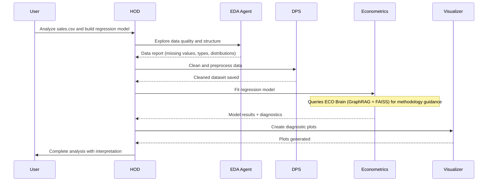

<p align="center">
  <h1 align="center">🧠 StatAgents</h1>
  <p align="center">
    <strong>An open-source multi-agent data-science toolkit built on AutoGen for collaborative statistical modeling and analytics.</strong>
  </p>
  <p align="center">
    <a href="#-getting-started">Getting Started</a> •
    <a href="#-architecture">Architecture</a> •
    <a href="#-agents">Agents</a> •
    <a href="#-knowledge-layer">Knowledge Layer</a> •
    <a href="#-evaluation--observability">Evaluation</a> •
    <a href="#-usage">Usage</a>
  </p>
  <p align="center">
    
    
    
    
    
    
  </p>
</p>

---

StatAgents is a multi-agent system where **10 specialized AI agents** collaborate to perform end-to-end statistical analysis — from data exploration and cleaning to econometric modeling, hypothesis testing, time series forecasting, and professional LaTeX report generation. Each agent has domain-specific expertise backed by **GraphRAG and FAISS knowledge bases** built from statistical textbooks, enabling rigorous, textbook-grounded analysis rather than generic LLM responses.

**Key highlights:**

- 🎓 **HOD-orchestrated Swarm** — A Head of Department agent dynamically routes tasks to 9 specialist agents using AutoGen's Swarm handoff pattern
- 📚 **Textbook-grounded intelligence** — GraphRAG and FAISS knowledge bases built from econometrics and DOE textbooks provide agents with deep statistical methodology knowledge
- 🐳 **Sandboxed code execution** — All Python code runs inside Docker containers for safe, reproducible analysis
- 📊 **Empirically validated RAG** — Statistical hypothesis testing (not vibes) determined the optimal retrieval method: Local GraphRAG + FAISS hybrid
- 🔍 **Full observability** — Token tracking dashboard, agent routing maps, and conversation analytics for every experiment

---

## 🏗️ Architecture

```mermaid
flowchart TB
    User(["🧑 User"]) --> UI["🖥️ Streamlit UI"]
    UI --> HOD

    subgraph Orchestration
        HOD["🎓 HOD<br/>Head of Department"]
    end

    subgraph Knowledge["Knowledge Layer"]
        HOD_Brain[("📚 HOD Brain<br/>FAISS<br/>Business Storytelling<br/>+ Workflow Knowledge")]
        ECO_Brain[("📗 ECO Brain<br/>GraphRAG + FAISS<br/>Econometrics Textbooks")]
        DOE_Brain[("📘 DOE Brain<br/>GraphRAG + FAISS<br/>DOE Textbooks")]
        STAT_RAG[("📙 Statistical Analysis RAG<br/>FAISS<br/>Statistical Tests<br/>+ Statistics Books")]
    end

    subgraph Agents["Specialist Agents"]
        EDA["📊 EDA Agent"]
        DPS["🔧 Data Processing<br/>Specialist"]
        ECO["📈 Econometrics<br/>Agent"]
        DOE["🧪 DOE Agent"]
        TS["📉 Time Series<br/>Agent"]
        STAT["🧮 Statistician"]
        VIZ["🎨 Visualizer<br/>Agent"]
        CODE["💻 Code Executor"]
        REDDIT["🌐 Reddit News<br/>Agent"]
    end

    subgraph Execution["Execution Layer"]
        Docker["🐳 Docker Container<br/>Python 3.11 Runtime"]
        RedditAPI["Reddit API"]
    end

    subgraph Output["Output Layer"]
        LaTeX["📄 LaTeX Report<br/>Generation"]
        TokenDash["📊 Token Tracking<br/>Dashboard"]
        RAGDash["📊 RAG Evaluation<br/>Dashboard"]
    end

    HOD -->|delegates| EDA
    HOD -->|delegates| DPS
    HOD -->|delegates| ECO
    HOD -->|delegates| DOE
    HOD -->|delegates| TS
    HOD -->|delegates| STAT
    HOD -->|delegates| VIZ
    HOD -->|delegates| CODE
    HOD -->|delegates| REDDIT

    HOD -.->|"FAISS query via tool"| HOD_Brain
    ECO -.->|"GraphRAG Local + FAISS"| ECO_Brain
    DOE -.->|"GraphRAG Local + FAISS"| DOE_Brain
    STAT -.->|"FAISS"| STAT_RAG

    DPS -->|execute_python_code| Docker
    ECO -->|execute_python_code| Docker
    DOE -->|execute_python_code_T| Docker
    TS -->|execute_python_code_T| Docker
    STAT -->|execute_python_code| Docker
    VIZ -->|execute_python_code| Docker
    CODE -->|execute_python_code| Docker

    REDDIT -->|reddit_search_all| RedditAPI

    EDA -.->|handoff| HOD
    DPS -.->|handoff| HOD
    ECO -.->|handoff| HOD
    DOE -.->|handoff| HOD
    TS -.->|handoff| HOD
    STAT -.->|handoff| HOD
    VIZ -.->|handoff| HOD
    CODE -.->|handoff| HOD
    REDDIT -.->|handoff| HOD

    HOD --> LaTeX
    HOD --> TokenDash
```



### Workflow Example



---

## 🤖 Agents

| Agent | Role | Tools | Knowledge Base |
|-------|------|-------|----------------|
| 🎓 **HOD** | Orchestrator — routes tasks, synthesizes results, provides business-friendly explanations | FAISS query tool | HOD Brain (FAISS) |
| 📊 **EDA Agent** | Exploratory data analysis — data profiling, summary statistics, quality assessment | `analyze_csv_data` | — |
| 🔧 **Data Processing Specialist** | Data cleaning — missing values, outliers, transformations, feature engineering | `analyze_csv_data`, `execute_python_code` | — |
| 📈 **Econometrics Agent** | Regression modeling — OLS, GLS, 2SLS, diagnostics, assumption testing | `retrieve_graphrag_local_Eco`, `retrieve_Eco_rag`, `execute_python_code` | ECO Brain (GraphRAG + FAISS) |
| 🧪 **DOE Agent** | Design of experiments — factorial designs, RSM, Taguchi methods, interaction analysis | `retrieve_graphrag_local_Doe`, `retrieve_doe_rag`, `execute_python_code_T` | DOE Brain (GraphRAG + FAISS) |
| 📉 **Time Series Agent** | Forecasting — ARIMA, decomposition, ACF/PACF, stationarity testing | `execute_python_code_T` | — |
| 🧮 **Statistician** | Hypothesis testing — t-tests, ANOVA, chi-square, normality tests, non-parametric tests | `retrieve_statistical_test`, `retrieve_statistics_books`, `execute_python_code` | Statistical Analysis RAG (FAISS) |
| 🎨 **Visualizer Agent** | Visualization — diagnostic plots, distribution charts, correlation matrices, custom visuals | `execute_python_code` | — |
| 💻 **Code Executor** | General-purpose Python execution for ad-hoc computations | `execute_python_code` | — |
| 🌐 **Reddit News Agent** | External knowledge retrieval — recent trends, reviews, domain-specific discussions from Reddit | `reddit_search_all` | — |

All agents operate under AutoGen's **Swarm** handoff pattern: the HOD delegates tasks to specialist agents, who complete their work and hand control back. This enables dynamic, data-driven routing rather than rigid pipelines.

---

## 📚 Knowledge Layer

StatAgents uses a **hybrid retrieval architecture** combining Microsoft GraphRAG and FAISS vector search, with each knowledge base tailored to its agent's domain.

### Knowledge Bases

| Brain | Type | Content | Used By |
|-------|------|---------|---------|
| **HOD Brain** | FAISS | Business storytelling templates, workflow knowledge | HOD |
| **ECO Brain** | GraphRAG + FAISS | Econometrics textbooks — methods, diagnostics, assumptions | Econometrics Agent |
| **DOE Brain** | GraphRAG + FAISS | DOE textbooks — experimental design, factorial methods | DOE Agent |
| **Statistical Analysis RAG** | FAISS | Statistical tests, statistics reference books | Statistician |

### Why GraphRAG + FAISS Hybrid?

The ECO and DOE agents use a **hybrid retrieval approach** — querying both GraphRAG (Local search) and FAISS in parallel, then combining results for comprehensive answers. This architecture was not chosen arbitrarily; it was determined through rigorous statistical evaluation (see [Evaluation](#-evaluation--observability)).

GraphRAG excels at capturing **entity relationships** in statistical methodology (e.g., how heteroscedasticity relates to OLS assumptions, which diagnostic test to use), while FAISS provides fast **semantic similarity** retrieval for direct concept lookup. Together, they give agents both structural understanding and precise recall.

---

## 📊 Evaluation & Observability

### RAG Evaluation

We conducted a rigorous evaluation to determine the optimal retrieval method for our knowledge bases, testing across **60 curated questions** with ground truth answers from econometrics and DOE textbooks.

**Evaluation design:**
- Questions stratified by **type** (conceptual, theoretical, factual) and **difficulty** (easy, medium, hard)
- Three retrieval methods compared: **Local GraphRAG**, **Global GraphRAG**, and **FAISS**
- LLM-as-judge evaluation across 8 metrics: faithfulness, relevance, precision, recall, correctness, conciseness, uncertainty, and latency
- Statistical hypothesis testing to validate significance of differences

**Key results:**

| Method | Overall Score | Faithfulness | Relevance | Recall | Avg Latency | Cost |
|--------|:---:|:---:|:---:|:---:|:---:|:---:|
| **Local GraphRAG** | **0.836** | 1.000 | 0.942 | 0.682 | 36.0s | ₹1.32 |
| Global GraphRAG | 0.798 | 1.000 | 0.933 | 0.634 | 283.5s | ₹1.30 |
| FAISS | 0.793 | 0.975 | 0.950 | 0.475 | 4.7s | ₹1.49 |

**Local GraphRAG** achieved the highest overall quality score with perfect faithfulness, leading to the **Local GraphRAG + FAISS hybrid** architecture used in production — combining Local GraphRAG's superior recall with FAISS's speed.

A dedicated **Streamlit dashboard** provides interactive visualization of all evaluation metrics, statistical test results, and comparative analysis.

> 📄 *Detailed evaluation methodology, statistical analysis, and findings: [Coming Soon]*
>
> 📹 *Dashboard demo video: Coming Soon*

### Agent Observability Dashboard

A comprehensive **Streamlit dashboard** for monitoring and evaluating the multi-agent system in real time:

- **Token tracking** — Per-agent and total token consumption for every conversation
- **Agent routing maps** — Visual representation of which agents were invoked and in what order
- **Conversation analytics** — Full breakdown of agent-to-agent communication, handoff patterns, and message flow
- **Experiment tracking** — Compare different agent configurations, prompt variations, and routing strategies side-by-side

This observability layer makes the system fully transparent and experimentally reproducible — essential for both development iteration and academic evaluation.

> 📹 *Dashboard demo video: Coming Soon*

---

## 📁 Project Structure

```
StatAgents/
├── Agents System prompt/     # System prompts for each agent (.txt files)
├── HOD Brain/                # HOD knowledge base (FAISS)
│   ├── business_storytelling_templates/
│   └── workflow_knowledge/
├── ECO Brain/                # Econometrics knowledge base (GraphRAG + FAISS)
├── DOE Brain/                # DOE knowledge base (GraphRAG + FAISS)
├── Statistical Analysis RAG/ # Statistical inference knowledge base (FAISS)
├── Test Dataset/             # Sample datasets for testing
├── Token/                    # Token tracking data and logs
├── coding/                   # Docker code execution workspace
├── data/                     # Data storage
├── latex_templates/          # LaTeX report generation templates
│
├── main.py                   # Application entry point
├── agents.py                 # Agent definitions and Swarm team setup
├── prompts.py                # Prompt loading utility
├── Rag.py                    # GraphRAG and FAISS retrieval functions
├── tool.py                   # Agent tools (CSV analysis, code execution)
├── model_client_wrapper.py   # Azure OpenAI client with token tracking
├── token_tracker.py          # Token consumption tracking system
├── TokenVS.py                # Token visualization and analytics
├── ui.py                     # Streamlit chat interface
├── reddit1.py                # Reddit search integration
│
├── Dockerfile                # Docker image for sandboxed Python execution
├── requirements.txt          # Python dependencies
├── .env.example              # Environment variable template
└── .gitignore
```

---

## 🚀 Getting Started

### Prerequisites

- **Python 3.11+**
- **Docker** (for sandboxed code execution)
- **Azure OpenAI** access (GPT-4o-mini deployment)
- **Git**

### Installation

1. **Clone the repository**

```bash
git clone https://github.com/sahilmerai/StatAgents.git
cd StatAgents
```

2. **Install dependencies**

```bash
pip install -r requirements.txt
```

3. **Configure environment variables**

```bash
cp .env.example .env
```

Edit `.env` with your Azure OpenAI credentials and other configuration values. Refer to `.env.example` for all required variables.

4. **Build the Docker image**

The Docker container provides a sandboxed Python 3.11 runtime with pre-installed data science packages (pandas, numpy, matplotlib, seaborn, scikit-learn, scipy, statsmodels).

```bash
docker build -t python-executor .
```

5. **Run the application**

```bash
streamlit run ui.py
```

---

## 💡 Usage

Once the Streamlit UI is running, you can interact with the agent team through natural language. The HOD automatically routes your request to the appropriate specialist agents.

### Example Queries

| Query | Agents Involved |
|-------|----------------|
| *"Analyze this sales dataset and give me a summary"* | HOD → EDA → DPS |
| *"Build a regression model to predict revenue"* | HOD → EDA → DPS → Econometrics → Visualizer |
| *"Is there a significant difference between group A and B?"* | HOD → Statistician |
| *"Design a 2³ factorial experiment for my process"* | HOD → DOE |
| *"Forecast next 6 months of sales"* | HOD → EDA → DPS → Time Series |
| *"What are the latest trends in restaurant analytics?"* | HOD → Reddit News |
| *"Generate a LaTeX report of the analysis"* | HOD → LaTeX Report Generation |

### How It Works

1. **You ask a question** or upload a dataset via the Streamlit chat interface
2. **HOD analyzes** your request and determines which agents are needed
3. **Specialist agents** execute their tasks — querying knowledge bases, running code in Docker, generating visualizations
4. **Results flow back** to HOD, who synthesizes everything into a coherent response
5. **Full trace** of agent interactions is available in the observability dashboard

---

## 🛠️ Tech Stack

| Component | Technology |
|-----------|------------|
| Agent Framework | [AutoGen](https://github.com/microsoft/autogen) (Swarm pattern) |
| LLM | Azure OpenAI GPT-4o-mini |
| Knowledge Graphs | [Microsoft GraphRAG](https://github.com/microsoft/graphrag) |
| Vector Search | FAISS |
| Code Execution | Docker (Python 3.11 sandbox) |
| UI | Streamlit |
| Report Generation | PyLaTeX |
| External Data | Reddit API |
| Token Tracking | Custom implementation |

---

## 🗺️ Roadmap

- [ ] Add more knowledge bases (time series, sampling theory textbooks)
- [ ] Expand GraphRAG evaluation to additional statistical domains
- [ ] Support additional LLM providers beyond Azure OpenAI
- [ ] Enhanced LaTeX report templates
- [ ] Batch processing mode for multiple datasets
- [ ] API endpoint for programmatic access
- [ ] Interactive agent workflow visualization in UI

---

## 🎓 Academic Context

This project is developed as part of the **MSc Applied Statistics** capstone project (2025-26) at **Veer Narmad South Gujarat University (VNSGU)**, Surat, Gujarat.

**Project Guide:** [Sahil Merai](https://www.linkedin.com/in/sahil-merai-780013185/) — Modeling Analyst, NIQ (SA&I COE) | Visiting Faculty, VNSGU

**Students:** Ravi, Jiya & Amruta

---

## 📄 Citation

If you use StatAgents in your research, please cite:

```bibtex
@software{statagents2025,
  title     = {StatAgents: A Multi-Agent Data Science Toolkit for Collaborative Statistical Modeling},
  author    = {Meria Sahil and Ravi and Jiya and Amruta},
  year      = {2025},
  url       = {https://github.com/sahilmerai/StatAgents},
  note      = {MSc Applied Statistics Capstone Project, VNSGU}
}
```

---

## 🤝 Contributing

Contributions are welcome! Please open an issue to discuss proposed changes before submitting a pull request.

---
