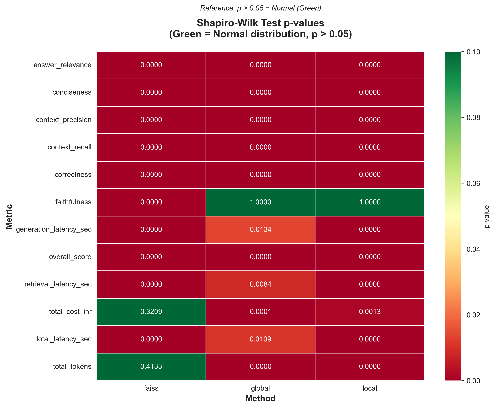
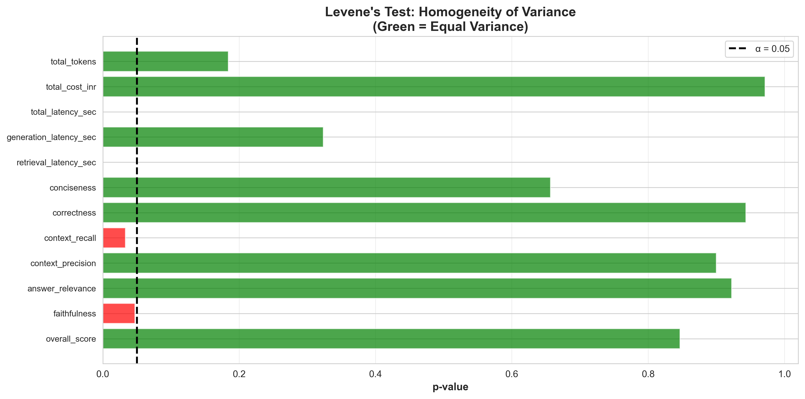
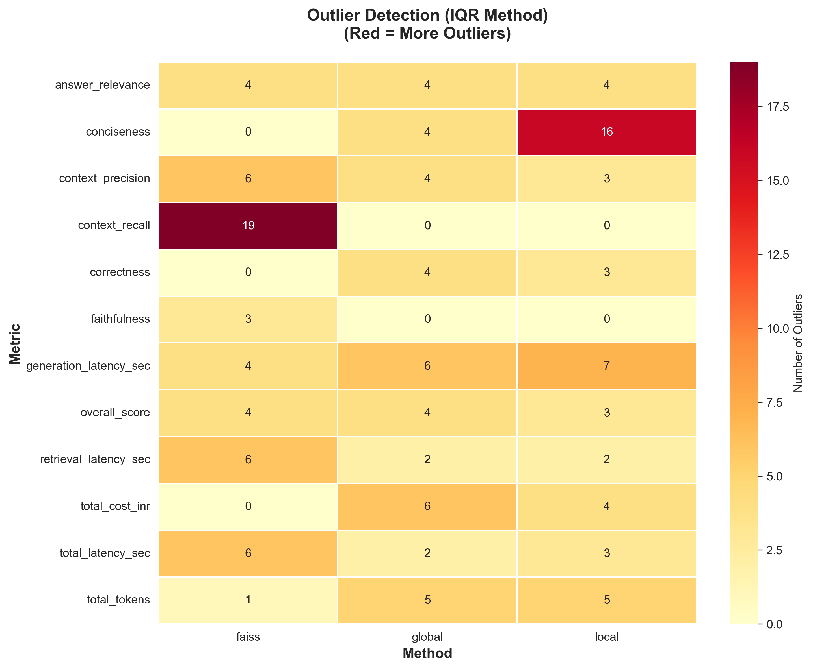
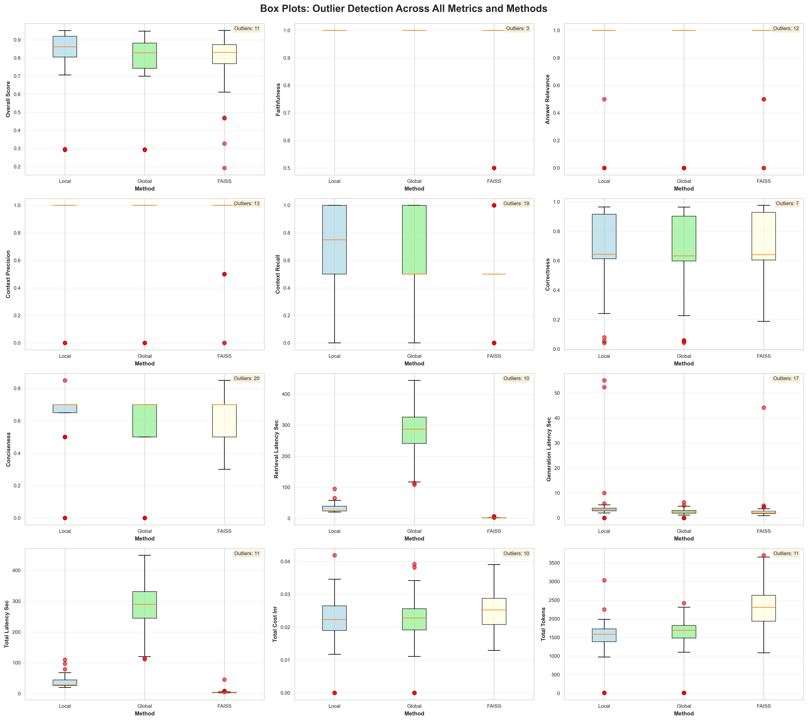
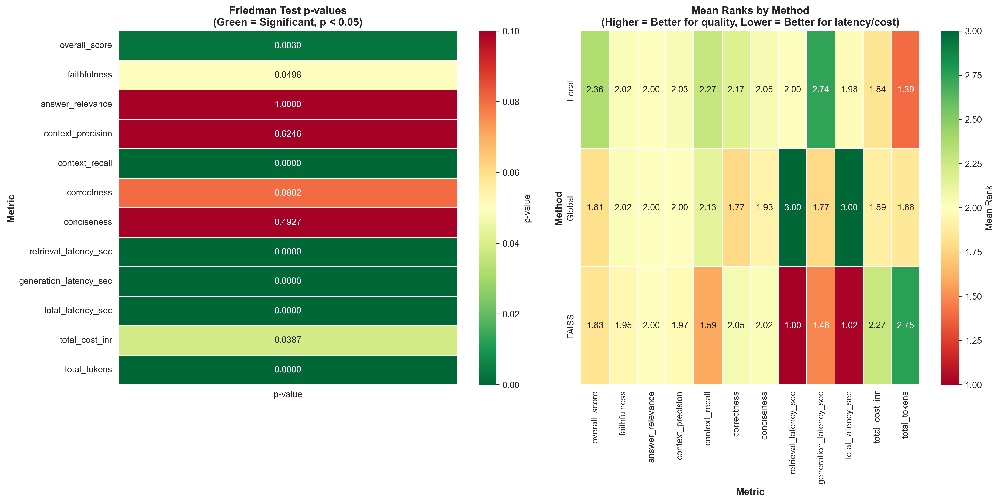
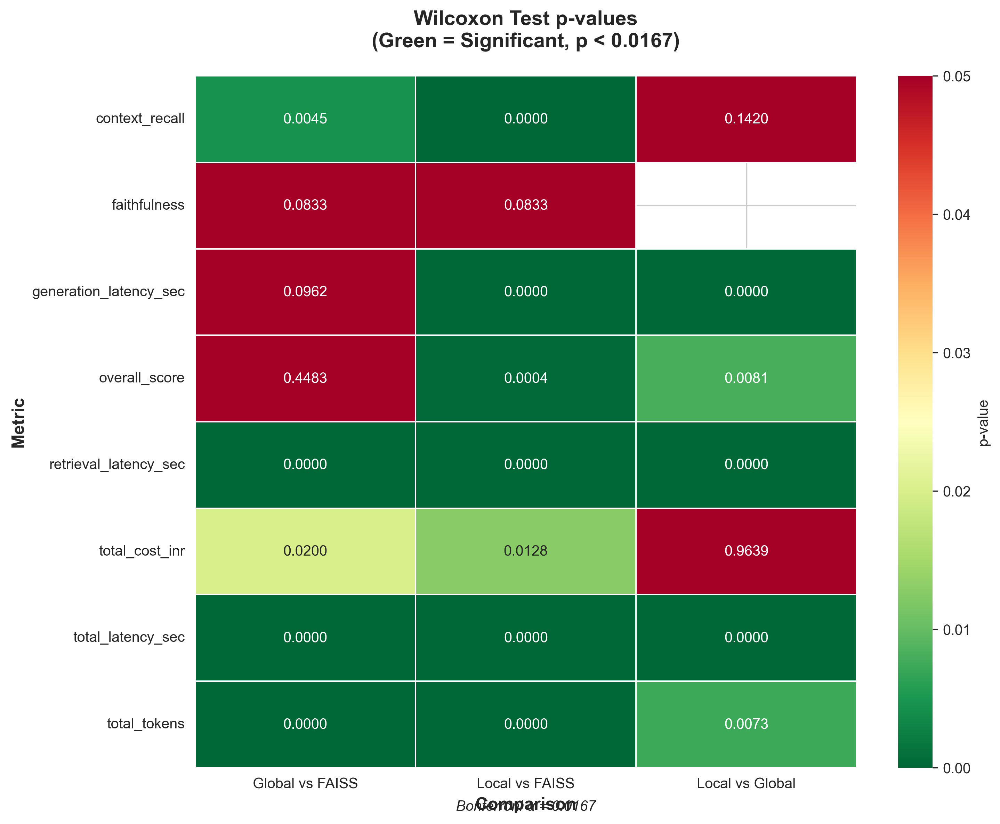
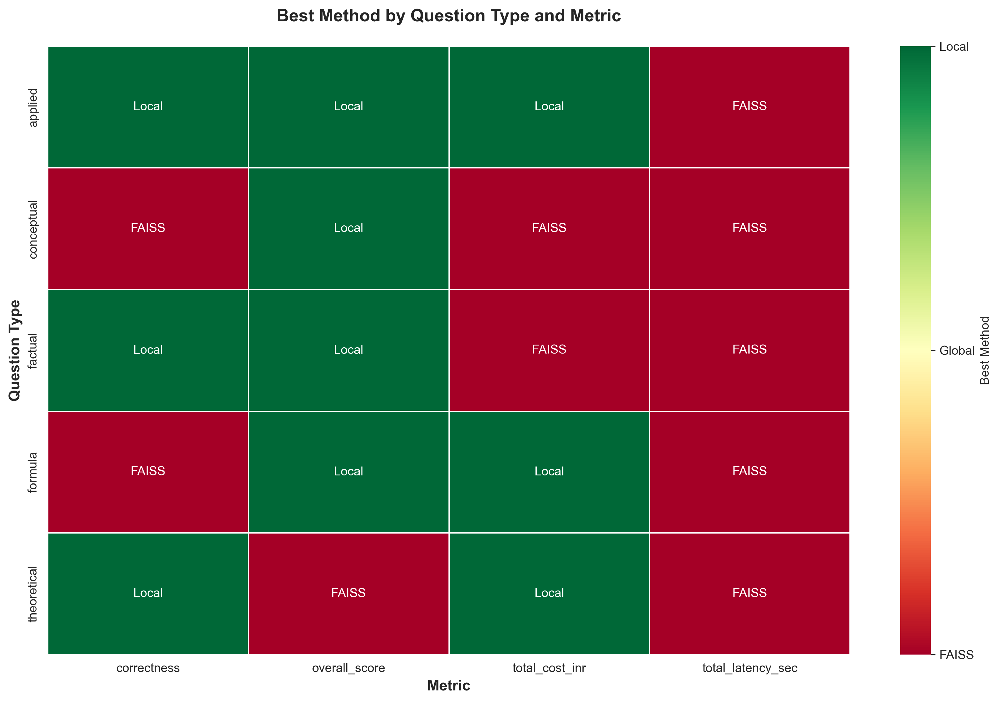
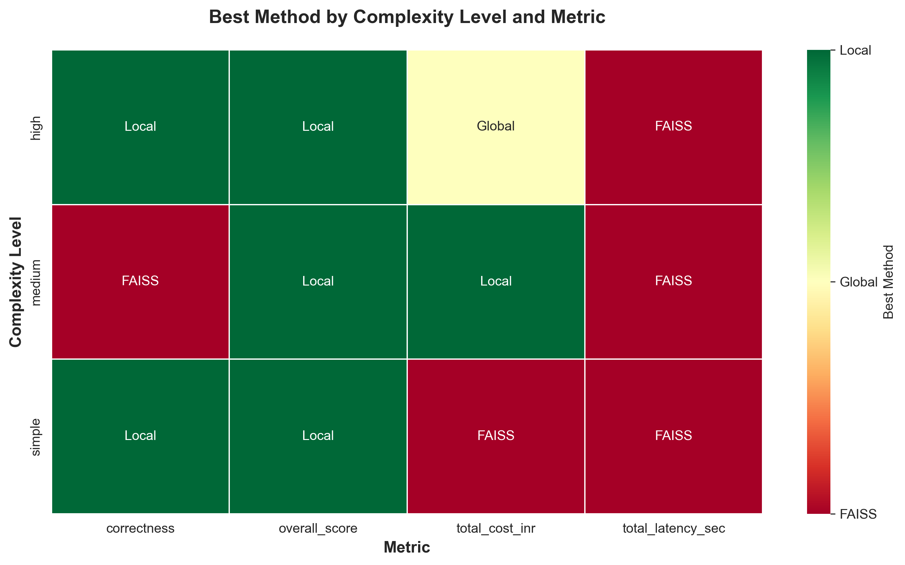

# 📊 RAG Evaluation — Statistical Analysis

A rigorous statistical analysis comparing three retrieval methods — **Local GraphRAG**, **Global GraphRAG**, and **FAISS** — to determine the optimal knowledge retrieval architecture for StatAgents.

---

## Overview

StatAgents uses retrieval-augmented generation (RAG) to provide agents with domain-specific knowledge from statistical textbooks. Choosing the right retrieval method directly impacts response quality, speed, and cost. Rather than relying on subjective assessment, we conducted a formal statistical evaluation using hypothesis testing to determine which method performs best — and whether that advantage is statistically significant.

### Evaluation Design

| Parameter | Value |
|-----------|-------|
| **Total Questions** | 60 (curated with ground truth answers) |
| **Subject Domains** | Econometrics, Design of Experiments (DOE) |
| **Question Types** | Conceptual, Theoretical, Factual |
| **Complexity Levels** | Simple, Medium, Hard |
| **Methods Compared** | Local GraphRAG, Global GraphRAG, FAISS |
| **Total Observations** | 180 (60 questions × 3 methods) |
| **Evaluation Approach** | LLM-as-Judge |

### Metrics Evaluated

**Performance Metrics:**
- `overall_score` — Composite quality score
- `faithfulness` — Factual accuracy relative to retrieved context
- `answer_relevance` — How well the answer addresses the question
- `context_precision` — Proportion of retrieved context that is relevant
- `context_recall` — Proportion of relevant context that was retrieved
- `correctness` — Accuracy compared to ground truth
- `conciseness` — Absence of unnecessary information

**Operational Metrics:**
- `retrieval_latency_sec` — Time to retrieve relevant context
- `generation_latency_sec` — Time to generate the answer
- `total_latency_sec` — End-to-end response time
- `total_cost_inr` — Cost per query in INR
- `total_tokens` — Token consumption per query

---

## Step 1: Assumption Checking

Before selecting statistical tests, we verified whether parametric test assumptions hold for our data.

### 1.1 Normality Testing — Shapiro-Wilk Test

**Hypothesis:**

> **H₀:** The data follows a normal distribution
>
> **H₁:** The data does NOT follow a normal distribution
>
> **Decision Rule:** Reject H₀ if p-value < 0.05

We applied the Shapiro-Wilk test to each metric for each method (12 metrics × 3 methods = 36 tests).

**Results:**

| Summary | Value |
|---------|-------|
| Tests passing normality | 11.1% |
| Tests failing normality | 88.9% |

**✗ Conclusion:** The vast majority of distributions are non-normal. Parametric tests (ANOVA, t-test) are NOT appropriate.

---

### 1.2 Homogeneity of Variance — Levene's Test

**Hypothesis:**

> **H₀:** σ²_Local = σ²_Global = σ²_FAISS (variances are equal across methods)
>
> **H₁:** At least one method has a different variance
>
> **Decision Rule:** Reject H₀ if p-value < 0.05

**Interpretation:**
- If p > 0.05 → Equal variances (standard ANOVA OK)
- If p < 0.05 → Unequal variances (use Welch's ANOVA or non-parametric)

**Results:**

| Summary | Value |
|---------|-------|
| Metrics with equal variance | 66.7% |
| Metrics with unequal variance | 33.3% |

**✗ Conclusion:** One-third of metrics violate equal variance assumption. Combined with non-normality, this further supports using non-parametric tests.

---

### 1.3 Outlier Detection — IQR Method

**Method:**

> - Lower Bound = Q1 − 1.5 × IQR
> - Upper Bound = Q3 + 1.5 × IQR
> - Outliers: Values below Lower Bound OR above Upper Bound

Additionally, Z-score method (|z| > 3) was applied as a secondary check.

**Results:**

| Detection Method | Outliers Found |
|-----------------|:-:|
| IQR Method | 144 |
| Z-Score Method | 55 |

**⚠ Conclusion:** Significant number of outliers detected. Non-parametric tests are more robust to outliers than parametric alternatives.

---

### 1.4 Step 1 — Final Recommendation

| Check | Result | Implication |
|-------|--------|-------------|
| Normality | 11.1% pass | Non-parametric tests required |
| Equal Variance | 66.7% pass | Welch's ANOVA or non-parametric |
| Outliers | 144 detected | Use robust methods |

**🎯 Decision: Use NON-PARAMETRIC tests**
- **Friedman Test** — Non-parametric equivalent of repeated measures ANOVA
- **Wilcoxon Signed-Rank Test** — Non-parametric pairwise comparisons
- **Bonferroni Correction** — Adjust for multiple comparisons

---

## Step 2: Main Statistical Tests

### 2.1 Friedman Test — Overall Method Comparison

The Friedman test is a non-parametric alternative to repeated measures ANOVA. It ranks each question's scores across the three methods and tests whether the average ranks differ significantly.

**Hypothesis:**

> **H₀:** The distributions of all three methods are identical (no method is systematically better)
>
> **H₁:** At least one method has a significantly different distribution
>
> **Decision Rule:** Reject H₀ if p-value < 0.05

**Effect Size:** Kendall's W (coefficient of concordance)
- W < 0.1 → Negligible
- W = 0.1–0.3 → Small
- W = 0.3–0.5 → Medium
- W > 0.5 → Large

**Results — Overall Rankings:**

| Dimension | 🥇 1st | 🥈 2nd | 🥉 3rd |
|-----------|--------|--------|--------|
| **Performance Quality** | Local (Mean Rank: 2.131) | Global (1.952) | FAISS (1.917) |
| **Latency / Speed** | FAISS (fastest) | Local | Global (slowest) |
| **Cost Efficiency** | Local / Global | — | FAISS |

---

### 2.2 Wilcoxon Signed-Rank Test — Pairwise Comparisons

For metrics where the Friedman test found significant differences, we conducted pairwise comparisons using the Wilcoxon Signed-Rank Test.

**Hypothesis (for each pair):**

> **H₀:** The median difference between two methods = 0
>
> **H₁:** The median difference between two methods ≠ 0
>
> **Decision Rule:** Reject H₀ if p-value < 0.0167 (Bonferroni-corrected)

**Bonferroni Correction:**

Since we perform 3 pairwise comparisons (Local vs Global, Local vs FAISS, Global vs FAISS), the significance threshold is adjusted:

> α_adjusted = 0.05 / 3 = **0.0167**

This controls the family-wise error rate, reducing the chance of false positives from multiple testing.

**Effect Size:** Rank-biserial correlation (r)
- |r| < 0.3 → Small effect
- |r| = 0.3–0.5 → Medium effect
- |r| > 0.5 → Large effect

**Pairwise Comparisons:**

| Comparison | Quality | Speed | Cost |
|------------|---------|-------|------|
| **Local vs Global** | Local significantly better on recall | Global significantly slower | Similar |
| **Local vs FAISS** | Local significantly better on recall | FAISS significantly faster | Similar |
| **Global vs FAISS** | Similar quality | FAISS significantly faster | Similar |

---

### 2.3 Step 2 — Final Summary

| Criterion | Winner | Evidence |
|-----------|--------|----------|
| **Quality / Performance** | 🏆 **Local GraphRAG** | Highest mean rank (2.131), best recall, perfect faithfulness |
| **Speed / Latency** | 🏆 **FAISS** | 4.7s avg vs 36s (Local) vs 283s (Global) |
| **Cost Efficiency** | 🏆 **Local GraphRAG** | ₹1.32 avg, lowest cost |
| **Overall Recommendation** | 🏆 **Local GraphRAG** | Best quality + lowest cost, acceptable speed |

---

## Step 3: Contextual Analysis

Do the results change depending on question type or complexity? Or are the rankings consistent across all contexts?

### 3.1 Performance by Question Type

We applied the Friedman test within each question type (conceptual, theoretical, factual) to check if the best method varies by question type.

**Key Finding:** Local and FAISS trade wins across question types, but **no single question type fundamentally reverses the overall rankings**.

| Question Type | Quality Winner | Speed Winner |
|---------------|---------------|--------------|
| Conceptual | Local | FAISS |
| Theoretical | Local | FAISS |
| Factual | Local / FAISS | FAISS |

---

### 3.2 Performance by Complexity Level

We repeated the analysis across complexity levels (simple, medium, hard).

**Key Finding:** Local's quality advantage holds across all complexity levels. FAISS's speed advantage is consistent regardless of question difficulty.

| Complexity | Quality Winner | Speed Winner |
|------------|---------------|--------------|
| Simple | Local / FAISS | FAISS |
| Medium | Local / FAISS | FAISS |
| Hard | Local | FAISS |

---

### 3.3 Interaction Analysis

We tested whether Local's advantage over other methods changes with complexity — i.e., does the gap widen or narrow for harder questions?

**Results:**

| Comparison | Gap Variation (Std Dev) | Consistent? |
|------------|:---:|:---:|
| Local vs Global | Low | ✓ Yes — gap is stable |
| Local vs FAISS | Low | ✓ Yes — gap is stable |

**Conclusion:** No significant interaction effects. Method rankings are **context-independent**.

---

### 3.4 Step 3 — Final Summary

| Finding | Detail |
|---------|--------|
| Question Type Effect | None — rankings consistent across conceptual, theoretical, factual |
| Complexity Effect | None — rankings consistent across simple, medium, hard |
| Interaction Effects | Weak to none — Local's advantage is stable |
| Speed Consistency | FAISS is fastest across ALL contexts (100%) |
| Slowest Consistency | Global is slowest across ALL contexts (100%) |

**✓ Context does NOT fundamentally change which method is best.**

---

## Final Conclusions

### Summary of All Steps

| Step | Key Finding | Decision |
|------|-------------|----------|
| **Step 1: Assumptions** | 88.9% non-normal, 144 outliers | Use non-parametric tests (Friedman + Wilcoxon) |
| **Step 2: Main Tests** | Local wins quality, FAISS wins speed, Global wins nothing | Local GraphRAG is the primary choice |
| **Step 3: Context** | Rankings are consistent across all question types and complexity levels | Context-independent — results generalize |

### Recommendations

**✓ For Production (Quality Priority): Use Local GraphRAG**
- Best quality across all contexts
- Most cost-effective (₹1.32 avg per query)
- Acceptable speed (36 seconds avg)

**✓ For Real-Time (Speed Priority): Use FAISS**
- Fastest retrieval (4.7 seconds avg)
- Consistent across all contexts
- Acceptable quality trade-off

**✗ Avoid: Global GraphRAG**
- Slowest by a large margin (283 seconds avg)
- No clear advantage in any dimension
- Higher latency with no quality benefit

### Architecture Decision

Based on these findings, StatAgents uses a **Local GraphRAG + FAISS hybrid** architecture — combining Local GraphRAG's superior quality and recall with FAISS's speed for a balanced retrieval system.

---

## Methodology Reference

| Test | Purpose | When Used |
|------|---------|-----------|
| **Shapiro-Wilk** | Test normality of distributions | Step 1 — assumption checking |
| **Levene's Test** | Test equality of variances across groups | Step 1 — assumption checking |
| **IQR Method** | Detect outliers | Step 1 — assumption checking |
| **Friedman Test** | Compare 3+ related groups (non-parametric repeated measures ANOVA) | Step 2 — overall comparison |
| **Kendall's W** | Effect size for Friedman test | Step 2 — measure strength |
| **Wilcoxon Signed-Rank** | Pairwise comparison of 2 related groups (non-parametric) | Step 2 — pairwise follow-up |
| **Rank-Biserial Correlation** | Effect size for Wilcoxon test | Step 2 — measure pairwise effect |
| **Bonferroni Correction** | Adjust significance threshold for multiple comparisons | Step 2 — control false positives |

---

## Reproducibility

The complete analysis notebook is available at [`statistical Analysis Rag.ipynb`](statistical%20Analysis%20Rag.ipynb) in this directory. To reproduce:

1. Ensure the evaluation results CSV is available (generated by the RAG evaluation pipeline)
2. Install dependencies: `pandas`, `numpy`, `scipy`, `matplotlib`, `seaborn`
3. Run the notebook — all visualizations will be regenerated

---
